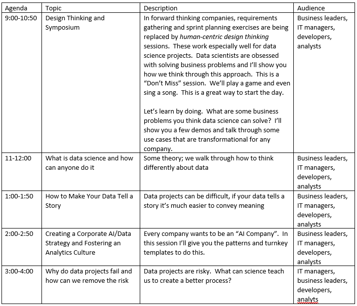

# Thinking Like a Data Scientist Workshop

Dave Wentzel  
davew@microsoft.com  
linkedin.com/in/dwentzel  

## Agenda

## Resources

### Design Thinking

[Discovery Session Handouts](https://git.davewentzel.com/workshops/ai-envisioning/-/blob/master/DiscoverySessionsHandouts.docx)

["Mini" Design Thinking Sessions](https://git.davewentzel.com/workshops/ai-envisioning/-/blob/master/Mini-Ideation.docx)
### What is data science and how can anyone do it?  

[Here is my slide deck](https://git.davewentzel.com/workshops/ai-envisioning/-/blob/master/slides/02-Tech.pdf).  

Would you like to learn how to build your own neural network and then learn how to use transfer learning to solve a computer vision problem by writing (or really, changing) about 5 lines of code?  Try your hand at my [Data Science Hackathon](https://git.davewentzel.com/demos/datasciencehack).  You can do this on your own, it takes about 8 hours and can be done without any fancy hardware or software.  
### How to Make Your Data Tell a Story

* [My "notebooks everywhere" repo](https://git.davewentzel.com/demos/notebooks-everywhere)
* [electric vehicles](https://git.davewentzel.com/demos/notebooks-everywhere/-/blob/master/02_ElectricVehicle.ipynb)
* [explain a ML model](https://git.davewentzel.com/demos/notebooks-everywhere/-/blob/master/model_explainability/readme.md)
* databricks data sandboxing demo
### Creating a Corporate AI/Data Strategy

* [Strategy](https://git.davewentzel.com/workshops/ai-envisioning/-/blob/master/slides/03-AI-Strategy.pdf)
* [Culture](https://git.davewentzel.com/workshops/ai-envisioning/-/blob/master/slides/04-AI-Culture.pdf)
* [Ethics](https://git.davewentzel.com/workshops/ai-envisioning/-/blob/master/slides/05-Ethics.pdf)

### Why do data projects fail and how can we remove some of the risk?

