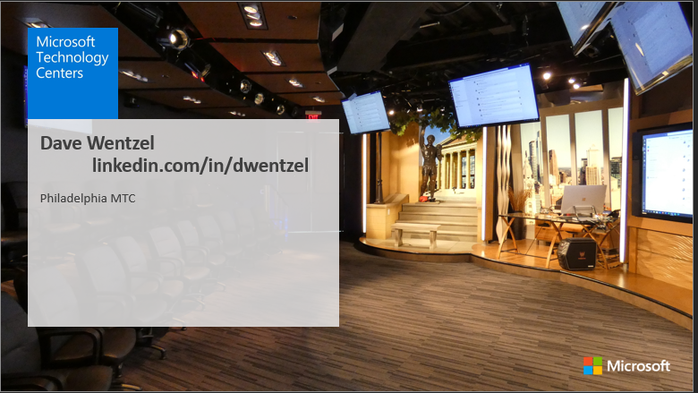
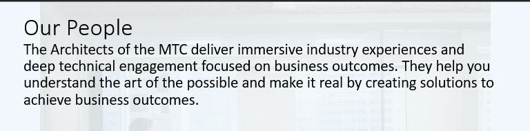
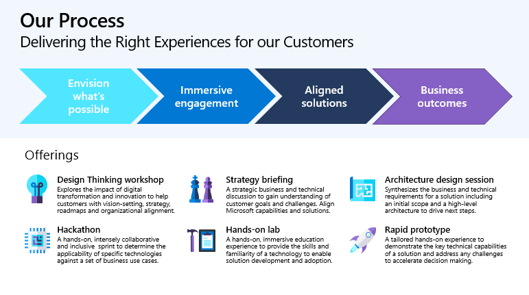

# Thinking Like a Data Scientist Workshop

Dave Wentzel  
linkedin.com/in/dwentzel  
11-2 

## Agenda

|Time|Topic|Description|Audience|
|---|---|---|---|
|11-12:30|Anyone Can Do Data Science|Some theory; we walk through how to think differently about data.  [SLIDE DECK](https://git.davewentzel.com/workshops/ai-envisioning/-/blob/master/slides/02-Tech.pdf)|Business Leaders, IT managers, Developers, Analysts
|12:45-1:50|Make Your Data Tell A Story|Data projects are difficult. But if your data tells a story it's much easier to convey meaning.|Business Leaders, IT managers, Developers, Analysts|
|2-3:00|Avoiding Analytical Mistakes and Q&A|Data is hard.  Numbers are hard.  Make sure you don't make mistakes interpreting your data. I'll show you some methods that data scientists use to avoid making analytical mistakes.  [SLIDE DECK](./mistakes.pdf)|Business Leaders, IT managers, Developers, Analysts|

## Resources
### How to Make Your Data Tell a Story

[My "notebooks everywhere" repo](https://git.davewentzel.com/demos/notebooks-everywhere) is the basis for most of these demos

